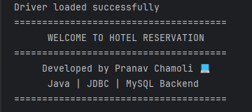
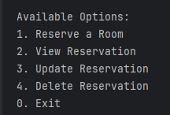
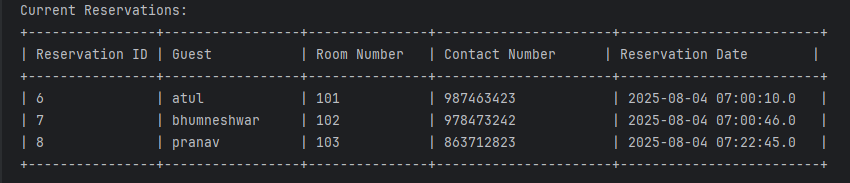

# 🏨 Hotel Reservation System

A basic **console-based hotel reservation system** built in Java using **JDBC** and **MySQL**.  
This project allows hotel staff to manage room bookings, view existing reservations, update details, and delete bookings.

---

## 🛠 Tech Stack

- **Java** (JDK 17+ or higher)
- **JDBC** for database connectivity
- **MySQL** (local server)
- **IntelliJ IDEA** or Eclipse

---

## ✨ Features

- 📥 Reserve a room (guest name, room number, contact)
- 📋 View all current reservations in a table format
- ✏️ Update an existing reservation
- ❌ Delete a reservation
- 💾 MySQL database integration

---

## 🗃️ Database Schema

```sql
CREATE DATABASE hotel_db;

USE hotel_db;

CREATE TABLE reservations (
    reservation_id INT AUTO_INCREMENT PRIMARY KEY,
    guest_name VARCHAR(100),
    room_number INT,
    contact_number VARCHAR(15),
    reservation_date TIMESTAMP DEFAULT CURRENT_TIMESTAMP
);
````

---

## 🚀 How to Run

1. ✅ Make sure MySQL is running on port `3306` or update it in the code.
2. 🔌 Update your database credentials in `HotelReservationSystem.java`:

   ```java
   private static final String url = "jdbc:mysql://localhost:3306/hotel_db";
   private static final String user = "root";
   private static final String password = "your_password";
   ```
3. 🛠 Compile and run the project from IntelliJ or using:

   ```bash
   javac -cp .:mysql-connector-j-<version>.jar HotelReservationSystem.java
   java -cp .:mysql-connector-j-<version>.jar HotelReservationSystem
   ```

---

## 📸 Screenshots

```




```

---

## 📚 Future Improvements

* Add a **web interface** using JSP/Servlet or Spring Boot
* Export reservation data to PDF or CSV
* Add **user authentication**
* GUI version with JavaFX or Swing

---

## 🧑‍💻 Author

* [Pranav Chamoli](https://github.com/PranavChamoli06)

---

## 📌 License

This project is open-source and free to use under the [MIT License](LICENSE).

